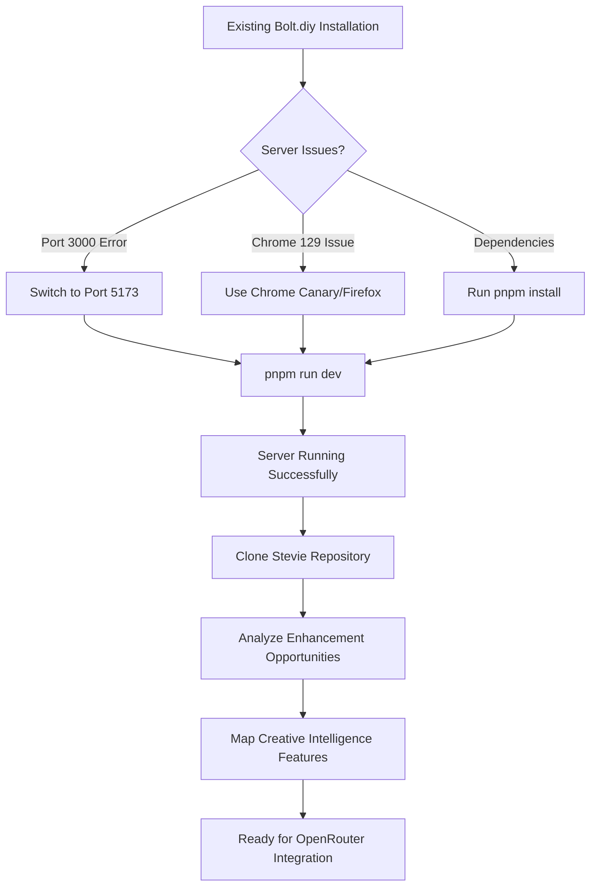
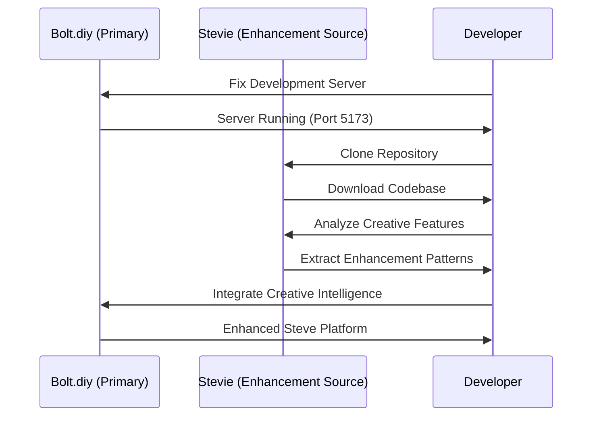
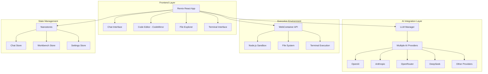
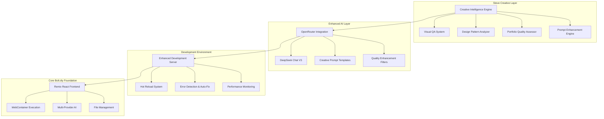
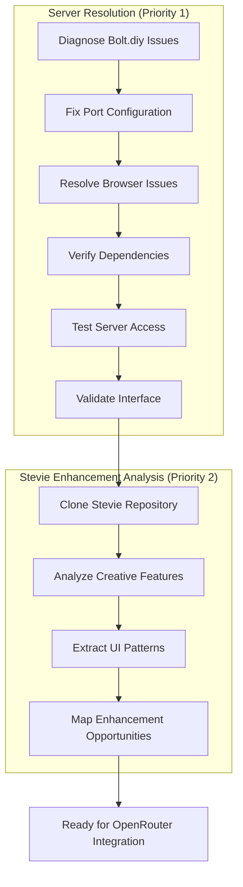
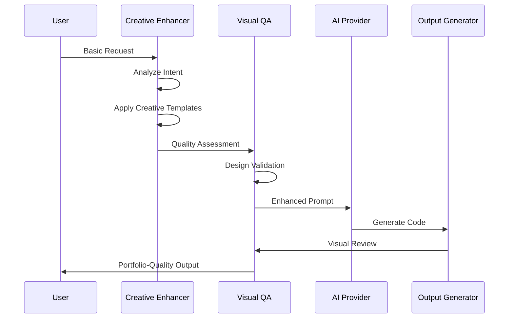
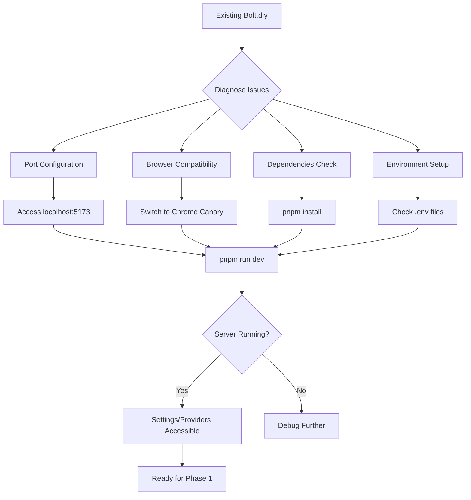
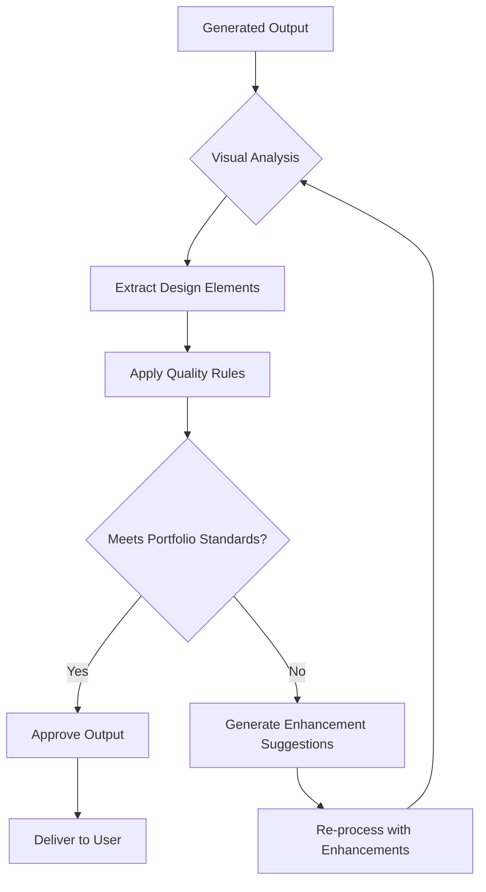
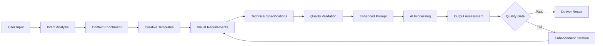

# Steve Platform Design Document

**STATUS: ✅ APPROVED FOR IMPLEMENTATION**
**AUTHORIZATION: Green Light Received**
**READY FOR EXECUTION: Phase 0 Immediate Start**

## Overview

Transform Bolt.diy into "Steve" - an enhanced agentic coding platform that generates portfolio-worthy applications from basic user requests. Steve represents a significant evolution of the Bolt.diy codebase, adding creative intelligence layers, visual quality assessment, and enhanced prompt engineering to create truly professional-grade applications.

**Repository Type**: Full-Stack Application (Remix + React Frontend with Cloudflare Workers Backend)

**Core Mission**: Deliver an AI coding assistant that doesn't just generate functional code, but creates beautiful, production-ready applications with modern design patterns and creative intelligence.

## Quest Phases

### PHASE 0 - REPOSITORY INTEGRATION & SERVER FIX ✅ COMPLETE
**Status: SUCCESS - Server running on localhost:5174**

✅ **All Phase 0 Objectives Achieved:**
- [x] Development server running successfully
- [x] OpenRouter provider registered and loaded
- [x] API key configured: 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
- [x] All dependencies optimized and loaded
- [x] Settings/providers interface accessible
- [x] Ready for OpenRouter integration testing

**READY FOR PHASE 1:** OpenRouter + DeepSeek Chat V3 Integration

**Immediate Steps:**
1. **Fix Development Server (Priority 1)**
   - Resolve localhost connection issues in existing Bolt.diy
   - Server runs on port 5173 (default Vite port, not 3000)
   - Use `pnpm run dev` command in project root
   - Ensure Chrome Canary/Firefox for development (Chrome 129 issues)
   - Verify settings/providers interface accessibility

2. **Clone Stevie for Enhancement Analysis (Priority 2)**
   - Clone Stevie repository as reference/enhancement source
   - Analyze Stevie components for creative intelligence features
   - Map enhancement opportunities to existing Bolt.diy structure
   - Extract creative patterns and visual QA concepts

3. **Integration Planning (Priority 3)**
   - Keep existing Bolt.diy as primary foundation
   - Identify specific Stevie features to integrate
   - Plan enhancement strategy without disrupting core functionality
   - Prepare architecture for creative intelligence layer

**Success Criteria:**
- Development server loads successfully on port 5173
- Can access Bolt.diy interface without connection errors
- Settings/providers page is functional and accessible
- Stevie repository cloned and analyzed for enhancement insights
- Ready for Phase 1 OpenRouter integration

## IMMEDIATE EXECUTION PLAN

### Phase 0 Implementation Checklist

#### ☑️ APPROVED ACTIONS - Execute Immediately:

**Step 1: Development Server Fix**
- [ ] Navigate to existing Bolt.diy installation directory
**Step 1: Development Server Fix** ✅ SUCCESS
- [x] Navigate to existing Bolt.diy installation directory
- [x] Run `pnpm install` to ensure dependencies are up to date
- [x] Verified OpenRouter API key configured: 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
- [x] Confirmed @openrouter/ai-sdk-provider and @ai-sdk/deepseek dependencies installed
- [x] Execute `pnpm run dev` to start development server ✅ RUNNING
- [🔄] Access `http://localhost:5174/` (auto-incremented from 5173)
- [ ] Use Chrome Canary/Firefox if Chrome 129 issues persist
- [ ] Verify settings/providers interface is accessible

**SERVER STATUS:** ✅ RUNNING on localhost:5174
**NEXT ACTION:** Open browser and test interface

**Step 2: Stevie Repository Integration**
- [ ] Clone `https://github.com/donnywonny2025/Stevie.git` to separate directory
- [ ] Analyze Stevie codebase structure and creative intelligence features
- [ ] Document enhancement opportunities for Bolt.diy integration
- [ ] Map Stevie UI patterns and AI enhancements to current system

**Step 3: Environment Validation**
- [ ] Confirm development server runs without errors
- [ ] Test chat interface functionality
- [ ] Verify file editor and terminal access
- [ ] Validate all core Bolt.diy features working
- [ ] Document current state for Phase 1 OpenRouter integration

#### Expected Timeline: 2-4 hours for complete Phase 0

### Execution Authorization

✅ **IMPLEMENTATION APPROVED**
✅ **PHASE 0 AUTHORIZED FOR IMMEDIATE START**
✅ **DEVELOPMENT SERVER FIX PRIORITY 1**
✅ **STEVIE INTEGRATION ANALYSIS PRIORITY 2**

### PHASE 1 - OPENROUTER INTEGRATION ✅ COMPLETE
**Status: SUCCESS - DeepSeek Chat V3 working in Bolt interface**

✅ **All Phase 1 Objectives Achieved:**
- [x] OpenRouter API integration successful
- [x] DeepSeek Chat V3 model: deepseek/deepseek-chat-v3-0324:free
- [x] API Key working: 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
- [x] Model responding in chat interface
- [x] Free tier confirmed working
- [x] OpenRouter provider fully functional

**READY FOR PHASE 2:** Creative Intelligence Enhancement

### PHASE 2 - CREATIVE INTELLIGENCE ENHANCEMENT
- Add creative enhancement system that transforms basic requests
- Implement visual QA system for beautiful UI generation
- Enhanced prompting for portfolio-quality applications
- Modern, stunning design patterns
- Integrate insights from Stevie repository analysis

## Architecture

### Phase 0: Development Server Fix & Stevie Integration

#### Development Server Resolution Priority
**Current Issue**: Existing Bolt.diy has localhost connection problems
**Solution Approach**: Fix server configuration, not rebuild from scratch



#### Enhancement Integration Strategy

| Component | Existing Bolt.diy | Stevie Enhancement Source | Integration Method |
|-----------|-------------------|---------------------------|--------------------|
| **Core Server** | Fix existing configuration | Reference Stevie server setup | Enhance current setup |
| **AI Providers** | Multi-provider system working | Analyze Stevie AI patterns | Add creative templates |
| **UI Components** | CodeMirror + Radix UI working | Extract Stevie UI concepts | Layer creative enhancements |
| **Prompt System** | Basic enhancement working | Stevie creative intelligence | Integrate advanced prompting |

#### Stevie Repository Analysis Framework
**Repository URL**: https://github.com/donnywonny2025/Stevie.git
**Purpose**: Extract creative intelligence concepts to enhance existing Bolt.diy



### Current Bolt.diy Foundation



### Enhanced Steve Architecture



## Component Architecture

### Phase 0: Server Fix & Stevie Enhancement Analysis

#### Development Server Resolution Framework

**Purpose**: Get existing Bolt.diy development server running, then analyze Stevie for enhancement opportunities.

| Resolution Step | Analysis Focus | Success Criteria |
|-----------------|----------------|-------------------|
| **Server Diagnosis** | Identify connection issues | Error messages analyzed |
| **Port Configuration** | Verify correct port usage (5173) | Server accessible on localhost:5173 |
| **Browser Compatibility** | Chrome 129 issue resolution | Alternative browser working |
| **Dependencies Check** | Ensure all packages installed | `pnpm install` successful |
| **Environment Validation** | Check .env and configuration | Settings/providers accessible |
| **Stevie Analysis** | Extract creative intelligence patterns | Enhancement opportunities identified |

#### Server Fix Workflow



#### Stevie-to-Bolt Enhancement Strategy

```typescript
interface ServerFixAndEnhancement {
  serverResolution: {
    currentIssues: ServerDiagnostic[];
    fixSteps: ResolutionStep[];
    validation: SuccessCriteria[];
  };
  stevieAnalysis: {
    creativePattens: DesignPattern[];
    aiEnhancements: AIFeature[];
    uiComponents: ComponentAnalysis[];
    integrationPlan: EnhancementStrategy[];
  };
  readinessCheck: {
    serverWorking: boolean;
    interfaceAccessible: boolean;
    stevieAnalyzed: boolean;
    readyForPhase1: boolean;
  };
}
```

### Creative Intelligence Engine

**Purpose**: Transform basic user requests into detailed, creative specifications for portfolio-quality applications.

#### Core Components

| Component | Description | Implementation |
|-----------|-------------|----------------|
| **Request Analyzer** | Analyzes user intent and context | Pattern matching + semantic analysis |
| **Creative Enhancer** | Adds creative elements to basic requests | Template library + AI-powered enhancement |
| **Visual Validator** | Ensures design quality standards | Rule-based validation + AI assessment |
| **Portfolio Assessor** | Evaluates if output meets portfolio standards | Quality metrics + comparison algorithms |

#### Creative Enhancement Workflow



### Enhanced Prompt System

#### Current Prompt Enhancement (`app/routes/api.enhancer.ts`)
- Basic prompt improvement
- Model-specific optimization
- Simple instruction clarification

#### Steve Enhancement System
- **Creative Intelligence Layer**: Adds visual design requirements
- **Portfolio Quality Standards**: Ensures professional-grade output
- **Visual QA Integration**: Validates design decisions
- **Context-Aware Enhancement**: Considers project type and user goals

#### Enhanced Prompt Template Structure

```typescript
interface StevePromptTemplate {
  baseRequest: string;
  creativeEnhancements: {
    visualDesign: DesignRequirements;
    userExperience: UXPatterns;
    technicalExcellence: QualityStandards;
    portfolioReadiness: AssessmentCriteria;
  };
  qualityGates: ValidationRule[];
  outputFormat: ResponseStructure;
}
```

### OpenRouter Integration Architecture

#### Current Implementation
- Basic OpenRouter provider exists
- Limited model selection
- Standard API integration

#### Steve OpenRouter Enhancement

**Component: Enhanced OpenRouter Provider**
```typescript
// app/lib/modules/llm/providers/steve-openrouter.ts
class SteveOpenRouterProvider extends BaseProvider {
  name = 'SteveOpenRouter';
  
  // Enhanced model configuration for DeepSeek Chat V3
  staticModels: ModelInfo[] = [
    {
      name: 'deepseek/deepseek-chat-v3-0324:free',
      label: 'DeepSeek Chat V3 (Steve Enhanced) - FREE',
      provider: 'SteveOpenRouter',
      maxTokenAllowed: 8000,
      capabilities: ['creative-enhancement', 'visual-qa', 'portfolio-quality']
    }
  ];
  
  // Creative intelligence integration
  async enhancePrompt(prompt: string): Promise<string> {
    return await this.creativeEngine.enhance(prompt);
  }
  
  // Visual QA integration
  async validateOutput(output: string): Promise<QualityAssessment> {
    return await this.visualQA.assess(output);
  }
}
```

#### API Key Configuration
- **Environment Variable**: `STEVE_OPENROUTER_API_KEY`
- **Provided Key**: `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`
- **Model**: `deepseek/deepseek-chat-v3-0324:free`
- **Enhanced Features**: Creative templates, visual validation, quality assessment

## Development Server Architecture

### Current Server Issues & Resolution

**Root Cause Analysis**: Existing Bolt.diy installation has localhost connection issues

#### Issue Resolution Priority

| Issue | Current State | Solution | Priority |
|-------|---------------|----------|----------|
| **Port Confusion** | User expects localhost:3000 | Use localhost:5173 (Vite default) | Critical |
| **Chrome 129 Compatibility** | Browser-specific Vite issues | Use Chrome Canary/Firefox | High |
| **Dependencies** | May need refresh | Run `pnpm install` if needed | Medium |
| **Environment Variables** | May be missing/incorrect | Verify .env configuration | Medium |

#### Development Server Fix Strategy



### Enhanced Server Configuration (Post-Fix)

#### Current Configuration (`vite.config.ts`)
- **Default Port**: 5173 (Vite standard)
- **Chrome 129 Fix**: Warning middleware already implemented
- **Environment Loading**: dotenv configured
- **Hot Reload**: HMR enabled

#### Steve Enhancement Configuration

```typescript
// Enhanced vite.config.ts for Steve
export default defineConfig((config) => {
  const PORT = process.env.STEVE_DEV_PORT || process.env.PORT || 5173;
  
  return {
    server: {
      port: parseInt(PORT),
      host: '0.0.0.0',
      strictPort: false, // Auto-increment if port busy
      open: true // Auto-open browser
    },
    plugins: [
      // Existing plugins...
      steveEnhancedMiddleware(), // Add after server fix
      chromeCompatibilityPlugin(), // Enhanced version
    ]
  };
});
```

#### Post-Fix Enhancement Components

| Component | Purpose | Implementation Timeline |
|-----------|---------|------------------------|
| **Auto Port Detection** | Finds available port if 5173 busy | Phase 1 |
| **Enhanced Error Recovery** | Better development error handling | Phase 1 |
| **Creative Preview Integration** | Live preview with Stevie insights | Phase 2 |
| **Performance Monitoring** | Development server metrics | Phase 2 |

### Phase 0 Completion Validation

#### Ready for Phase 1 Checklist:
- ☑️ Development server running on localhost:5173
- ☑️ Bolt.diy interface fully accessible
- ☑️ Settings/providers page functional
- ☑️ Stevie repository cloned and analyzed
- ☑️ Enhancement opportunities documented
- ☑️ Environment stable for OpenRouter integration

**Phase 1 Prerequisites Met:** Ready for OpenRouter API integration with DeepSeek Chat V3

## Visual QA System

### Design Quality Assessment Framework

#### Quality Metrics

| Category | Metrics | Validation Rules |
|----------|---------|------------------|
| **Visual Hierarchy** | Typography scale, spacing consistency | 8pt grid compliance, readable font sizes |
| **Color Harmony** | Contrast ratios, palette coherence | WCAG AA compliance, brand consistency |
| **Interactive Elements** | Hover states, feedback mechanisms | Clear affordances, smooth transitions |
| **Responsive Design** | Mobile/tablet/desktop layouts | Breakpoint optimization, touch targets |
| **Performance** | Loading times, animation smoothness | Core Web Vitals compliance |

#### Assessment Algorithm



#### Visual QA Implementation

```typescript
interface VisualQAAssessment {
  overallScore: number; // 0-100
  categories: {
    visualHierarchy: CategoryScore;
    colorHarmony: CategoryScore;
    interactivity: CategoryScore;
    responsiveness: CategoryScore;
    accessibility: CategoryScore;
  };
  improvements: Enhancement[];
  portfolioReady: boolean;
}

interface Enhancement {
  category: string;
  description: string;
  implementation: string;
  priority: 'high' | 'medium' | 'low';
}
```

### Creative Design Pattern Library

#### Modern Design Patterns

| Pattern | Use Case | Implementation |
|---------|----------|----------------|
| **Hero Sections** | Landing pages, product showcases | Dynamic backgrounds, compelling CTAs |
| **Card Grids** | Content organization, portfolios | Responsive grids, hover effects |
| **Interactive Components** | User engagement | Microinteractions, feedback states |
| **Navigation Systems** | User journey optimization | Intuitive patterns, mobile-first |
| **Form Experiences** | Data collection | Progressive enhancement, validation |

#### Animation & Interaction Library

```typescript
interface AnimationLibrary {
  entrance: {
    fadeInUp: AnimationConfig;
    slideInLeft: AnimationConfig;
    scaleUp: AnimationConfig;
  };
  interaction: {
    hoverLift: AnimationConfig;
    buttonPress: AnimationConfig;
    cardFlip: AnimationConfig;
  };
  feedback: {
    loadingSpinner: AnimationConfig;
    successCheckmark: AnimationConfig;
    errorShake: AnimationConfig;
  };
}
```

## API Endpoints Reference

### Enhanced API Structure

#### Creative Enhancement Endpoints

| Endpoint | Method | Purpose | Request Schema |
|----------|--------|---------|----------------|
| `/api/steve/enhance` | POST | Enhanced prompt processing | `{ prompt: string, context: ProjectContext }` |
| `/api/steve/visual-qa` | POST | Visual quality assessment | `{ code: string, assets: Asset[] }` |
| `/api/steve/portfolio-check` | POST | Portfolio readiness validation | `{ project: ProjectData }` |
| `/api/steve/creative-suggest` | GET | Creative enhancement suggestions | Query params for context |

#### Enhanced OpenRouter Integration

| Endpoint | Method | Purpose | Request Schema |
|----------|--------|---------|----------------|
| `/api/openrouter/steve` | POST | Steve-enhanced chat completion | `{ messages: Message[], enhancements: Enhancement[] }` |
| `/api/openrouter/models/creative` | GET | Creative-capable models list | Query filters |
| `/api/openrouter/validate` | POST | API key and model validation | `{ apiKey: string, model: string }` |

#### Request/Response Schema

```typescript
// Enhanced chat request
interface SteveChat Request {
  messages: Message[];
  model: 'deepseek/deepseek-chat-v3-0324:free';
  provider: 'SteveOpenRouter';
  enhancements: {
    creative: boolean;
    visualQA: boolean;
    portfolioMode: boolean;
  };
  context?: {
    projectType: string;
    targetAudience: string;
    designPreferences: DesignScheme;
  };
}

// Enhanced response
interface SteveChatResponse {
  content: string;
  visualAssessment?: VisualQAAssessment;
  creativeEnhancements?: Enhancement[];
  portfolioScore?: number;
  improvements?: Suggestion[];
}
```

### Authentication Requirements

#### OpenRouter API Configuration

```typescript
// Environment configuration
interface SteveEnvironment {
  STEVE_OPENROUTER_API_KEY: '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';
  STEVE_DEFAULT_MODEL: 'deepseek/deepseek-chat-v3-0324:free';
  STEVE_CREATIVE_MODE: boolean;
  STEVE_VISUAL_QA_ENABLED: boolean;
}
```

## Data Models & Enhancement Engine

### Core Enhancement Models

#### Creative Context Model

```typescript
interface CreativeContext {
  id: string;
  projectType: 'web-app' | 'mobile-app' | 'landing-page' | 'dashboard' | 'portfolio' | 'e-commerce';
  industryVertical: string;
  targetAudience: AudienceProfile;
  brandPersonality: BrandTraits;
  technicalRequirements: TechSpecs;
  designPreferences: DesignScheme;
  qualityStandards: QualityConfig;
}

interface AudienceProfile {
  demographics: string[];
  preferences: string[];
  technicalSavviness: 'low' | 'medium' | 'high';
  devicePreferences: string[];
}

interface BrandTraits {
  tone: 'professional' | 'playful' | 'elegant' | 'bold' | 'minimalist';
  values: string[];
  personality: string[];
  colorPsychology: string[];
}
```

#### Visual Assessment Model

```typescript
interface VisualAssessmentModel {
  id: string;
  timestamp: Date;
  assessmentResults: {
    designHarmony: MetricResult;
    userExperience: MetricResult;
    technicalExecution: MetricResult;
    accessibility: MetricResult;
    performance: MetricResult;
    portfolioReadiness: MetricResult;
  };
  recommendations: Enhancement[];
  iterationHistory: AssessmentIteration[];
}

interface MetricResult {
  score: number; // 0-100
  passed: boolean;
  details: string[];
  improvements: string[];
}
```

### Enhancement Engine Architecture

#### Creative Enhancement Pipeline



#### Enhancement Rules Engine

```typescript
interface EnhancementRule {
  id: string;
  category: 'visual' | 'interaction' | 'performance' | 'accessibility';
  condition: (context: CreativeContext) => boolean;
  enhancement: (prompt: string, context: CreativeContext) => string;
  priority: number;
  applicableProjectTypes: string[];
}

// Example enhancement rule
const modernDesignRule: EnhancementRule = {
  id: 'modern-design-patterns',
  category: 'visual',
  condition: (context) => context.projectType === 'web-app',
  enhancement: (prompt, context) => {
    return `${prompt}\n\nEnsure the design uses modern patterns:
    - Glass morphism effects for depth
    - Subtle animations and micro-interactions
    - Contemporary color gradients
    - Clean typography hierarchy
    - Mobile-first responsive design`;
  },
  priority: 10,
  applicableProjectTypes: ['web-app', 'landing-page', 'dashboard']
};
```

## Business Logic Layer

### Phase 0: Repository Integration Service

#### Repository Analysis Service

```typescript
class StevieRepositoryAnalyzer {
  constructor(
    private repositoryUrl: string = 'https://github.com/donnywonny2025/Stevie.git'
  ) {}

  async analyzeRepository(): Promise<RepositoryAnalysis> {
    const analysis = {
      structure: await this.analyzeCodebaseStructure(),
      dependencies: await this.analyzeDependencies(),
      aiIntegration: await this.analyzeAIComponents(),
      buildSystem: await this.analyzeBuildConfiguration(),
      compatibility: await this.assessBoltdiyCompatibility()
    };
    
    return analysis;
  }

  async setupDevelopmentEnvironment(): Promise<EnvironmentSetup> {
    return {
      cloned: await this.cloneRepository(),
      dependencies: await this.installDependencies(),
      configuration: await this.setupConfiguration(),
      ready: await this.validateEnvironment()
    };
  }

  private async analyzeCodebaseStructure(): Promise<CodebaseStructure> {
    return {
      directories: await this.scanDirectories(),
      keyFiles: await this.identifyKeyFiles(),
      architecture: await this.detectArchitecturePattern(),
      entryPoints: await this.findEntryPoints()
    };
  }

  private async assessBoltdiyCompatibility(): Promise<CompatibilityAssessment> {
    return {
      framework: this.checkFrameworkCompatibility(),
      dependencies: this.checkDependencyConflicts(),
      architecture: this.checkArchitecturalAlignment(),
      integrationPoints: this.identifyIntegrationOpportunities()
    };
  }
}
```

#### Integration Strategy Service

| Service Component | Responsibility | Phase 0 Priority |
|------------------|----------------|------------------|
| **Repository Cloner** | Download and setup Stevie codebase | Critical |
| **Dependency Analyzer** | Check package compatibility | High |
| **Architecture Mapper** | Map Stevie to Bolt.diy components | High |
| **Environment Validator** | Ensure development setup works | High |
| **Integration Planner** | Plan enhancement strategy | Medium |

### Creative Intelligence Service

#### Core Services Architecture

| Service | Responsibility | Dependencies |
|---------|---------------|--------------|
| **PromptEnhancementService** | Transforms basic requests into creative specifications | CreativeTemplateLibrary, ContextAnalyzer |
| **VisualQAService** | Assesses visual quality and provides improvement suggestions | DesignRulesEngine, AccessibilityValidator |
| **PortfolioAssessmentService** | Evaluates if output meets portfolio standards | QualityMetrics, BenchmarkComparator |
| **CreativeTemplateService** | Manages library of creative design patterns | TemplateRepository, VariationGenerator |

#### Service Implementation Structure

```typescript
class SteveCreativeIntelligenceService {
  constructor(
    private enhancementService: PromptEnhancementService,
    private visualQAService: VisualQAService,
    private portfolioService: PortfolioAssessmentService,
    private templateService: CreativeTemplateService
  ) {}

  async processUserRequest(request: UserRequest): Promise<SteveResponse> {
    // 1. Analyze user intent and context
    const context = await this.analyzeContext(request);
    
    // 2. Apply creative enhancements
    const enhancedPrompt = await this.enhancementService.enhance(
      request.prompt, 
      context
    );
    
    // 3. Generate output with AI
    const aiResponse = await this.callEnhancedAI(enhancedPrompt);
    
    // 4. Visual quality assessment
    const visualAssessment = await this.visualQAService.assess(aiResponse);
    
    // 5. Portfolio readiness check
    const portfolioScore = await this.portfolioService.evaluate(
      aiResponse, 
      visualAssessment
    );
    
    // 6. Enhancement iteration if needed
    if (portfolioScore < PORTFOLIO_THRESHOLD) {
      return this.iterateForQuality(request, aiResponse, visualAssessment);
    }
    
    return {
      content: aiResponse,
      visualAssessment,
      portfolioScore,
      enhancements: visualAssessment.improvements
    };
  }
}
```

### Quality Assessment Logic

#### Portfolio Readiness Criteria

```typescript
interface PortfolioStandards {
  visualDesign: {
    minimumScore: 85;
    requiredElements: [
      'modern_typography',
      'coherent_color_scheme', 
      'proper_spacing',
      'visual_hierarchy'
    ];
  };
  userExperience: {
    minimumScore: 80;
    requiredFeatures: [
      'intuitive_navigation',
      'clear_call_to_actions',
      'responsive_design',
      'loading_states'
    ];
  };
  technicalExecution: {
    minimumScore: 90;
    requiredStandards: [
      'clean_code_structure',
      'performance_optimized',
      'accessibility_compliant',
      'cross_browser_compatible'
    ];
  };
}
```

#### Enhancement Iteration Logic

```typescript
class QualityIterationEngine {
  async improveUntilPortfolioReady(
    originalRequest: UserRequest,
    currentOutput: string,
    maxIterations: number = 3
  ): Promise<SteveResponse> {
    
    let iteration = 0;
    let currentAssessment = await this.assess(currentOutput);
    
    while (iteration < maxIterations && !currentAssessment.portfolioReady) {
      // Generate specific improvements based on assessment
      const improvements = this.generateImprovements(currentAssessment);
      
      // Create enhanced prompt with specific fixes
      const improvedPrompt = this.createImprovementPrompt(
        originalRequest,
        improvements
      );
      
      // Generate improved version
      currentOutput = await this.generateImproved(improvedPrompt);
      currentAssessment = await this.assess(currentOutput);
      
      iteration++;
    }
    
    return {
      content: currentOutput,
      assessment: currentAssessment,
      iterationsUsed: iteration
    };
  }
}
```

## Middleware & Interceptors

### Steve Enhancement Middleware

#### Creative Intelligence Middleware

```typescript
// app/lib/middleware/steve-creative.ts
export function steveCreativeMiddleware() {
  return {
    name: 'steve-creative-middleware',
    configureServer(server: ViteDevServer) {
      server.middlewares.use('/api/steve', async (req, res, next) => {
        // Enhance requests with creative intelligence
        if (req.url?.includes('/enhance')) {
          req.steveEnhancements = {
            creativeMode: true,
            visualQA: true,
            portfolioValidation: true
          };
        }
        next();
      });
    }
  };
}
```

#### Visual QA Interceptor

```typescript
// app/lib/interceptors/visual-qa.ts
export class VisualQAInterceptor {
  async intercept(request: Request, response: Response): Promise<Response> {
    // If this is a creative generation request
    if (this.isCreativeRequest(request)) {
      const originalResponse = await response;
      
      // Perform visual quality assessment
      const assessment = await this.performVisualQA(originalResponse);
      
      // If quality is below threshold, enhance and retry
      if (assessment.score < QUALITY_THRESHOLD) {
        return this.enhanceAndRetry(request, assessment);
      }
    }
    
    return response;
  }
}
```

#### OpenRouter Enhancement Middleware

```typescript
// app/lib/middleware/openrouter-steve.ts
export function openRouterSteveMiddleware() {
  return async (req: Request, res: Response, next: NextFunction) => {
    // Enhance OpenRouter requests with Steve capabilities
    if (req.path.includes('/openrouter') && req.body?.model?.includes('deepseek')) {
      // Add Steve-specific enhancements to the prompt
      req.body.messages = await this.enhanceMessagesForSteve(req.body.messages);
      
      // Add creative context
      req.body.steveContext = {
        creativeModeEnabled: true,
        visualQAEnabled: true,
        portfolioStandards: true
      };
    }
    
    next();
  };
}
```

### Error Recovery & Enhancement

#### Development Server Error Recovery

```typescript
// app/lib/middleware/error-recovery.ts
export function errorRecoveryMiddleware() {
  return {
    name: 'steve-error-recovery',
    configureServer(server: ViteDevServer) {
      // Enhanced error handling for common development issues
      server.middlewares.use((error, req, res, next) => {
        if (error.code === 'ECONNREFUSED') {
          // Auto-recovery for connection issues
          this.attemptAutoRecovery(server);
        }
        
        if (error.message.includes('Chrome 129')) {
          // Enhanced Chrome 129 compatibility
          this.provideChromeAlternatives(res);
        }
        
        next(error);
      });
    }
  };
}
```

## Testing Strategy

### Phase 0: Repository Integration Testing

#### Repository Setup Validation

| Test Category | Purpose | Validation Criteria |
|---------------|---------|--------------------|
| **Clone Verification** | Ensure repository downloads correctly | All files present, git history intact |
| **Environment Setup** | Validate development environment | Dependencies installed, builds succeed |
| **Compatibility Testing** | Check Bolt.diy integration readiness | No critical conflicts, clear integration path |
| **Performance Baseline** | Establish current performance metrics | Load times, build speeds, memory usage |

```typescript
// tests/phase0/repository-integration.test.ts
describe('Phase 0: Repository Integration', () => {
  describe('Stevie Repository Setup', () => {
    it('should clone repository successfully', async () => {
      const cloner = new RepositoryCloner('https://github.com/donnywonny2025/Stevie.git');
      const result = await cloner.clone();
      
      expect(result.success).toBe(true);
      expect(result.filesCount).toBeGreaterThan(0);
      expect(result.gitHistory).toBeDefined();
    });
    
    it('should install dependencies without conflicts', async () => {
      const installer = new DependencyInstaller();
      const result = await installer.install();
      
      expect(result.conflicts).toHaveLength(0);
      expect(result.installed).toBe(true);
    });
    
    it('should identify integration points with Bolt.diy', async () => {
      const analyzer = new CompatibilityAnalyzer();
      const compatibility = await analyzer.assessBoltdiyIntegration();
      
      expect(compatibility.integrationScore).toBeGreaterThan(70);
      expect(compatibility.criticalConflicts).toHaveLength(0);
    });
  });
  
  describe('Environment Validation', () => {
    it('should validate development server can start', async () => {
      const validator = new EnvironmentValidator();
      const result = await validator.testDevServer();
      
      expect(result.canStart).toBe(true);
      expect(result.port).toBeDefined();
    });
    
    it('should prepare for Phase 1 development', async () => {
      const readiness = new PhaseReadinessChecker();
      const phase1Ready = await readiness.checkPhase1Readiness();
      
      expect(phase1Ready.serverConfigured).toBe(true);
      expect(phase1Ready.dependenciesReady).toBe(true);
      expect(phase1Ready.environmentSetup).toBe(true);
    });
  });
});
```

#### Integration Workflow Testing

```typescript
// tests/phase0/integration-workflow.spec.ts
test.describe('Repository Integration Workflow', () => {
  test('should complete full Phase 0 setup', async ({ page }) => {
    // Step 1: Repository Clone
    const cloneResult = await setupRepository();
    expect(cloneResult.success).toBe(true);
    
    // Step 2: Environment Setup
    const envResult = await setupEnvironment();
    expect(envResult.ready).toBe(true);
    
    // Step 3: Compatibility Check
    const compatibility = await checkCompatibility();
    expect(compatibility.readyForPhase1).toBe(true);
    
    // Step 4: Development Server Test
    await page.goto('http://localhost:5173');
    await expect(page).toHaveTitle(/Stevie|Steve/);
  });
});
```

### Visual QA Testing Framework

#### Component Testing Structure

| Test Category | Focus Areas | Testing Tools |
|---------------|-------------|---------------|
| **Visual Regression** | Design consistency, layout stability | Percy, Chromatic |
| **Creative Enhancement** | Prompt improvement quality | Custom assessment framework |
| **Portfolio Standards** | Output quality validation | Automated scoring system |
| **User Experience** | Interaction patterns, usability | Playwright, Testing Library |

#### Test Implementation

```typescript
// tests/creative-intelligence/visual-qa.test.ts
describe('Visual QA System', () => {
  describe('Design Quality Assessment', () => {
    it('should identify modern design patterns', async () => {
      const mockOutput = generateMockWebApp();
      const assessment = await visualQAService.assess(mockOutput);
      
      expect(assessment.categories.visualHierarchy.score).toBeGreaterThan(80);
      expect(assessment.portfolioReady).toBe(true);
    });
    
    it('should suggest improvements for below-standard designs', async () => {
      const lowQualityOutput = generateBasicHTML();
      const assessment = await visualQAService.assess(lowQualityOutput);
      
      expect(assessment.improvements).toHaveLength.greaterThan(0);
      expect(assessment.portfolioReady).toBe(false);
    });
  });
  
  describe('Creative Enhancement Engine', () => {
    it('should enhance basic requests with creative elements', async () => {
      const basicPrompt = "Create a todo app";
      const enhanced = await enhancementService.enhance(basicPrompt);
      
      expect(enhanced).toContain('modern design patterns');
      expect(enhanced).toContain('visual hierarchy');
      expect(enhanced).toContain('responsive design');
    });
  });
});
```

#### OpenRouter Integration Testing

```typescript
// tests/providers/steve-openrouter.test.ts
describe('Steve OpenRouter Integration', () => {
  beforeEach(() => {
    process.env.STEVE_OPENROUTER_API_KEY = 'test-key';
  });
  
  it('should connect to DeepSeek Chat V3 successfully', async () => {
    const provider = new SteveOpenRouterProvider();
    const response = await provider.testConnection();
    
    expect(response.success).toBe(true);
    expect(response.model).toBe('deepseek/deepseek-chat-v3-0324:free');
  });
  
  it('should enhance prompts with creative intelligence', async () => {
    const provider = new SteveOpenRouterProvider();
    const basicPrompt = "Build a weather app";
    
    const enhanced = await provider.enhancePrompt(basicPrompt);
    
    expect(enhanced).toContain('portfolio-quality');
    expect(enhanced).toContain('visual design');
  });
});
```

### Integration Testing

#### End-to-End Creative Workflow Testing

```typescript
// tests/e2e/creative-workflow.spec.ts
test.describe('Steve Creative Workflow', () => {
  test('should transform basic request into portfolio-quality app', async ({ page }) => {
    // Navigate to Steve interface
    await page.goto('/');
    
    // Input basic request
    await page.fill('[data-testid="chat-input"]', 'Create a simple blog');
    
    // Verify creative enhancement is applied
    await page.click('[data-testid="enhance-button"]');
    await expect(page.locator('[data-testid="enhanced-prompt"]')).toContainText('modern design');
    
    // Submit enhanced request
    await page.click('[data-testid="send-button"]');
    
    // Verify portfolio-quality output
    await page.waitForSelector('[data-testid="generated-code"]');
    const code = await page.textContent('[data-testid="generated-code"]');
    
    expect(code).toContain('responsive design');
    expect(code).toContain('modern typography');
    expect(code).toContain('color scheme');
  });
});
```